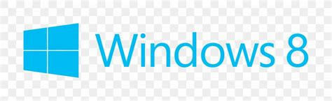

## essential-windows
#### https://vaginessa.github.io/essential-windows/
#### **essential Windows stuff, preferably FLOSS Software**

**Target: Win 8.1 64bit**

**GOOD BLOCKLIST:**
https://github.com/hagezi/dns-blocklists

https://o0.pages.dev/ | https://github.com/badmojr/1Hosts/

### Explorer++
Explorer++ is a small and fast file manager for Windows. With tabs, bookmarks and advanced file operations

https://explorerplusplus.com/

https://github.com/derceg/explorerplusplus

### All in One Runtimes
.NET Framework 4.8 + Updates | Java Runtime Environment 8
| DirectX 9.0c Zusatzdateien
| Allgemeine Runtime Dateien
| Microsoft Visual C++ Runtimes (v2005 - v2019)
| Microsoft Visual J# 2.0 SE
| Microsoft Silverlight 5
| Adobe Flash Player (Opera, FireFox, Internet Explorer)
| Shockwave Player 12 (Internet Explorer Plugin)

https://www.sereby.org/site/All%20in%20One%20Runtimes

### ASoft .NET Version Detector
ASoft .NET Version Detector is a lightweight tool that gives information on the different versions of Microsoft .NET and .NET Core that are installed on a machine.

https://asoft.be/prod_netver.html

### Sandboxie-Plus

https://github.com/sandboxie-plus/Sandboxie/releases/latest

### Process Hacker

https://processhacker.sourceforge.io/

**Nightly Builds:** https://ci.appveyor.com/project/processhacker/processhacker/build/artifacts

### DNS Jumper

https://www.sordum.org/7952/dns-jumper-v2-2/

**Download:**
https://www.sordum.org/downloads/?dns-jumper

### DNS-LOCK

https://www.sordum.org/9432/dns-lock-v1-4/

**Sownload:**
https://www.sordum.org/downloads/?st-dns-lock

### Notepad++

https://notepad-plus-plus.org/

https://github.com/notepad-plus-plus/notepad-plus-plus/releases

### Universal Extractor 2 (UniExtract2)

https://github.com/Bioruebe/UniExtract2/releases

### Bleachbit - Clean Your System and Free Disk Space

https://www.bleachbit.org/download/windows

**Nightly Builds:** https://ci.bleachbit.org/?prefix=dl/4.4.2.2237-master/

**Winapp2.ini Addon:** https://github.com/MoscaDotTo/Winapp2/raw/master/Non-CCleaner/Winapp2.ini

### Windows Firewall Control

https://www.binisoft.org/wfc.php

### WinDirStat

https://windirstat.net/download.html

### SMPlayer

https://github.com/smplayer-dev/smplayer/releases

### Zadig - USB driver installation made easy

https://zadig.akeo.ie/

### USB Oblivion
This utility designed to erase all traces of (broken) connected USB devices - flash-drives, disks and CD-ROMs from computer registry of Windows

https://www.cherubicsoft.com/en/projects/usboblivion/

### Driver Store Explorer [RAPR]
Driver Store Explorer [RAPR] makes it easier to deal with Windows driver store. Supported operations include list/add/install/delete third-party driver packages.

https://github.com/lostindark/DriverStoreExplorer/releases

### Snappy Driver Installer Origin
a portable Windows tool to install and update device drivers, can be used offline.

https://www.glenn.delahoy.com/snappy-driver-installer-origin/

### Botien Driver Installer
Automates the whole process of installing device drivers for you. You just have to specify the drivername.inf setup file then the software will do the rest.

https://github.com/bonfotieno/BDI

### WSCC - Windows System Control Center

https://www.kls-soft.com/wscc/downloads.php

https://github.com/vaginessa/WindowsSystemControlCenter_Keygen

### Librewolf - Firefox fork

https://gitlab.com/librewolf-community/browser/windows/-/releases

### EasyJoin

**EasyJoin Pro Windows:** https://easyjoin.net/windows.html

**EasyJoin Essential Android:** https://easyjoin.net/android_free.html

### Photon 🚀
**Cross-platform file-sharing application built with flutter**
Linux, MacOS, Windows, Android

https://github.com/abhi16180/photon/releases

### Localsend
Share files to nearby devices.
Free, open source, cross-platform. Linux, MacOS, Windows, Android, iOS

https://localsend.org/#/download

### Hoptodesk 🦘
Free remote desktop software featuring true end-to-end encrypted traffic, file transfer, and live chat.

https://www.hoptodesk.com/

### NAPS2 - Not Another PDF Scanner

https://www.naps2.com/

https://github.com/cyanfish/naps2

